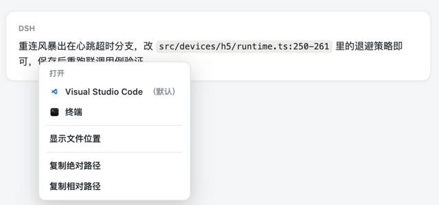

# dsh-file-link-menu

> DSH 文件引用右键菜单插件 —— 在 DSH 聊天输出里的**文件路径**上右键，直接用本机应用打开、在文件管理器中定位，或复制绝对/相对路径。


DSH 助手经常在回复里引用项目文件（行内代码路径、文件 chip、`dsh-resource://` 链接），但原生右键菜单对它们无能为力。本插件接管这些**文件引用**的右键事件，弹出一个原生风格的浮层菜单；代码块、普通文本、外部链接不受影响。



## 功能

| 菜单项 | 行为 |
| --- | --- |
| **用 <应用> 打开**（标注「默认」） | 用系统默认关联应用打开文件（带应用图标） |
| **用 <应用> 打开** | 本机所有注册了该文件类型关联的应用（带图标，逐项列出） |
| **显示文件位置** | 在系统文件管理器（Finder / 资源管理器）中定位该文件 |
| **复制绝对路径** | 复制 `<当前会话工作区>/<相对路径>` |
| **复制相对路径** | 复制相对于当前会话工作区的路径 |

## 识别范围（四层判据，按顺序）

1. `<a href="dsh-resource://file/session/<id>/<path>">` 资源地址链接
2. `[data-file-path]` 显式标记
3. Markdown 文件链接按钮 `<button title="<path>">`（含带图标的行内引用 chip）
4. 非代码块内的行内代码 `<code>`：全文恰为文件路径（容忍 `:行号` / `-行号` 后缀）

代码块（`<pre><code>`）、普通文本、外链一律**保持原生右键菜单**，不会被劫持。

## 安装

### 方式一：DSH Desktop CLI（推荐）

DSH Desktop 的插件即 profile 的 pnpm 依赖，直接用桌面内置 CLI 从 GitHub 安装：

```bash
DSH_HOME="$HOME/Library/Application Support/dsh-desktop/harness"

"$DSH_HOME/.desktop-bin/node" \
  "/Applications/DSH Desktop.app/Contents/Resources/app.asar.unpacked/node_modules/@deepseek-ai/dsh/lib/bin.js" \
  plugin --profile web add --save-exact github:XcodeFish/dsh-file-link-menu
```

- 也可写完整 URL：`https://github.com/XcodeFish/dsh-file-link-menu`（或 `git+https://…`），效果相同
- 用 `github:XcodeFish/dsh-file-link-menu#v1.0.0`（tag）或 `#<commit>` 可锁版本
- 已发布到 npm（`@codefisher798/dsh-file-link-menu`），可省事为：`plugin --profile web add @codefisher798/dsh-file-link-menu`

安装完成后**重启 DSH Desktop** 生效（client bundle 按文件 mtime 生成 rev 并版本化缓存，不重启不会重载）。

> 本插件纯 ESM、零依赖、无 `prepare` 构建脚本，不会触发 pnpm 的 `allowBuilds` 审批，装完即用。

### 方式二：DSH NEXT `plugin_manager`

```
plugin_manager install_bundle(target="github:XcodeFish/dsh-file-link-menu")
```

或在 DSH NEXT 里「设置 → 插件 → 添加插件」填入 `github:XcodeFish/dsh-file-link-menu`。

同样接受 `https://github.com/<用户名>/dsh-file-link-menu`、release 资产的 `.tgz` 地址、npm 包名或本地绝对路径；`#v1.0.0`（tag）或 `#<commit>` 可锁版本。

### 方式三：本地路径安装（开发调试）

```
plugin_manager install_bundle(target="<本仓库绝对路径>")
```

或 DSH Desktop CLI：

```bash
"$DSH_HOME/.desktop-bin/node" \
  "/Applications/DSH Desktop.app/Contents/Resources/app.asar.unpacked/node_modules/@deepseek-ai/dsh/lib/bin.js" \
  plugin --profile web add /path/to/dsh-file-link-menu
```

本地路径安装会以 `file:` 依赖形式写入 profile（与 DSH 内置插件的源码调试方式一致），改完代码重启即可看到效果。

### 卸载

```bash
"$DSH_HOME/.desktop-bin/node" \
  "/Applications/DSH Desktop.app/Contents/Resources/app.asar.unpacked/node_modules/@deepseek-ai/dsh/lib/bin.js" \
  plugin --profile web remove dsh-file-link-menu
```

卸载后重启 DSH Desktop。

## 使用

装好并重启后，在聊天输出里对**文件路径**右键：

- 出现「打开」分组：默认应用（标注「默认」）+ 本机文件关联应用（带图标）
- 「显示文件位置」（在系统文件管理器中定位）
- 「复制绝对路径」「复制相对路径」

打开与定位均通过 Session Remote 由 Host 执行，Host 端会对路径做二次校验（仅限当前会话工作区内的文件）。

## 工作原理与实现要点（踩过的坑）

- **client 插件必须注册 slot 才会被物化执行**。DSH 的 client 模块是惰性的——「插件首次被使用之前什么都不会运行」，`immediately: true` 只让脚本被加载并注册 factory，不等于执行 `apply()`。本插件注册空 slot（`conversation.session.header.utilities` / `conversation.composer.dock`）作为消费者。
- **文件打开走 Session Remote**：`session.workspacePathApplications({path})` 查关联应用，`session.openWorkspacePath({path, application})` 打开、`{path, action: 'reveal'}` 定位。
- **不要依赖 CSS Modules 生成的类名**（`fileMention` / `fileLink` 可能被构建 hash 化），判据以 `title` 与文本为准。
- **缩放/定位**：菜单挂 `document.body`，`position: fixed` + 高 `z-index`，并按视口边界收敛坐标。

## 开发与自测

```bash
node --check client.js
node self-test.mjs
```

预期输出：

```
button[title] right-click -> intercepted | menu: built (7 blocks)
inline code (no path) -> left to native menu (ok)

ROUND TRIP OK — menu build path no longer throws
```

`self-test.mjs` 是一个最小 DOM-stub 测试床：加载 `client.js`、执行 factory + `apply()`、合成一次右键事件，覆盖「菜单构建」与「判据放行」两条主路径，无需浏览器。

## 项目结构

| 文件 | 作用 |
| --- | --- |
| `package.json` | bundle 清单：`dsh.bundle.patch` + `dsh.client`（`platform: web`, `immediately: true`） |
| `cordis.patch.yml` | 组合行：`insert: id: file-link-menu, name: dsh-file-link-menu` |
| `index.js` | host 半边（空 `apply`；渲染与交互全在 client 半边） |
| `client.js` | 浏览器半边：右键监听 + 自绘浮层菜单 + Session Remote 调用 |
| `self-test.mjs` | 本地 DOM stub 自测（`node self-test.mjs`） |

## 兼容性

- DSH Desktop（`web` profile，含 0.10.x）/ DSH NEXT
- macOS / Windows / Linux：「打开」「显示文件位置」由 Host 调系统接口执行，理论上跨平台
- 无 Node / 浏览器 API 之外的运行时依赖

## FAQ

- **装完右键没反应？** 重启 DSH Desktop / DSH NEXT —— client bundle 的 rev 按 mtime 生成并版本化缓存。
- **代码块里的路径右键还是原生菜单？** 设计如此：代码块、普通文本、外链不劫持。
- **菜单里缺少某个应用？** 该应用需在系统里注册过对应文件类型的关联（`workspacePathApplications` 只返回系统注册过的应用）。
- **只对工作区内的文件生效吗？** 是。Host 端会二次校验路径，仅允许打开/定位当前会话工作区内的文件。

## License

[MIT](./LICENSE) © 2026 饮冰 (XcodeFish)